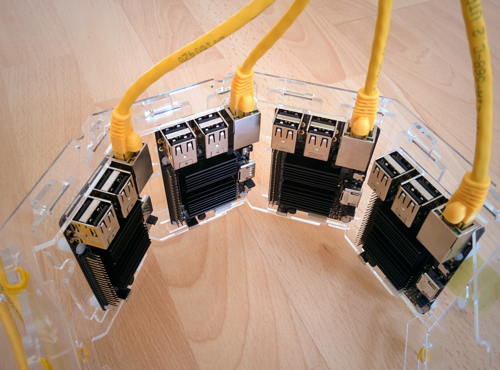
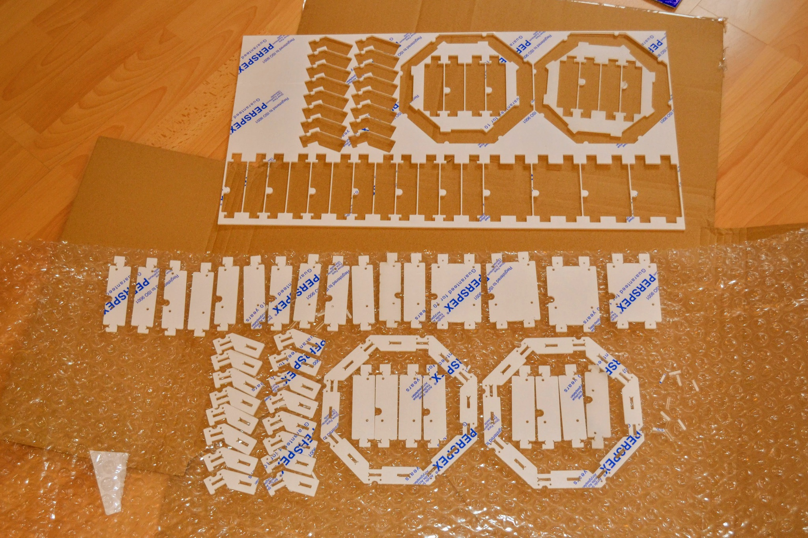

Odroid C2 cluster
=================

I wanted a proper Spark cluster for the Coursera course on [_Big Data Analysis with Scala and Spark_](https://www.coursera.org/learn/scala-spark-big-data), so I designed a case out of acrylic that could take eight [Odroid C2 SBCs](https://www.hardkernel.com/shop/odroid-c2/) and went about building a suitable setup. I networked the SBCs via a small hub and powered them via a multi-port USB charging device.

I designed the parts in [Inkscape](https://inkscape.org/) and had them cut by [Sculpteo](https://www.sculpteo.com/en/) (for more on Sculpteo and alternatives, see [`cutting-services.md`](cutting-services.md)).

You can see the results below. In the [`setup`](setup) subdirectory, you'll find detailed (if somewhat unorganized) notes on setting up the Odroid C2 SBCs for use as devices in the cluster, including setting up Spark, and on managing the cluster from a central device. These instructions include things such as getting the devices to advertise themselves to the central device, as willing to work as part of a Spark cluster, and enabling the central device to shutdown the cluster in one operation.

---

_Odroid C2 cluster_  

_Closeup - inside_  

_Closeup - outside_  

_Networking and power_  

_Laser-cut acrylic sheet_  

_Acrylic parts_  

_Assembled case_  

_Mounted Odroids_  

Parts
-----

You can find details of the parts [here](parts/README.md).

SVGs
----

You can find SVGs for the parts and more in the subdirectory [`svg-designs`](svg-designs). Some of the sizes were deduced from the photos in [`odroid-c2-photos`](odroid-c2-photos).
