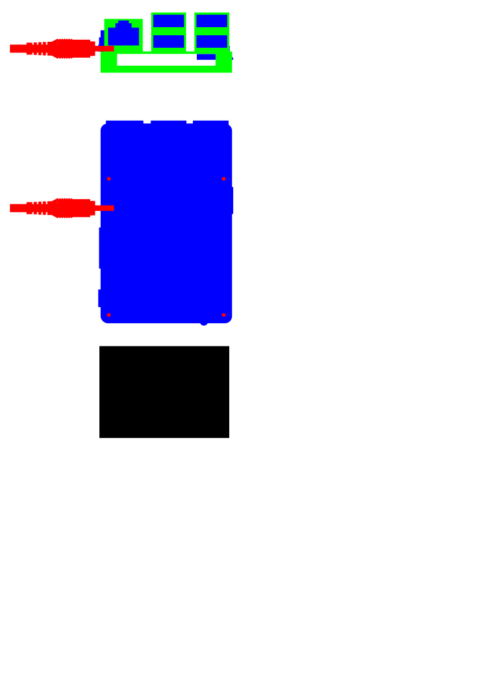
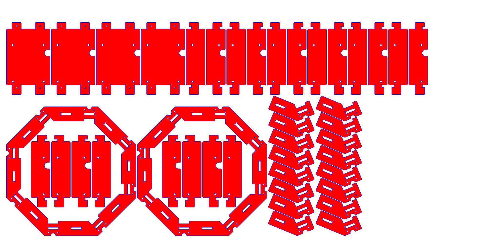
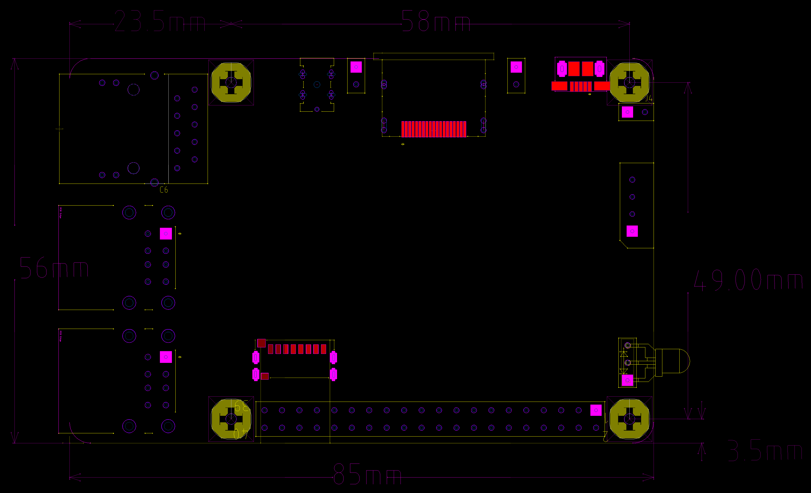
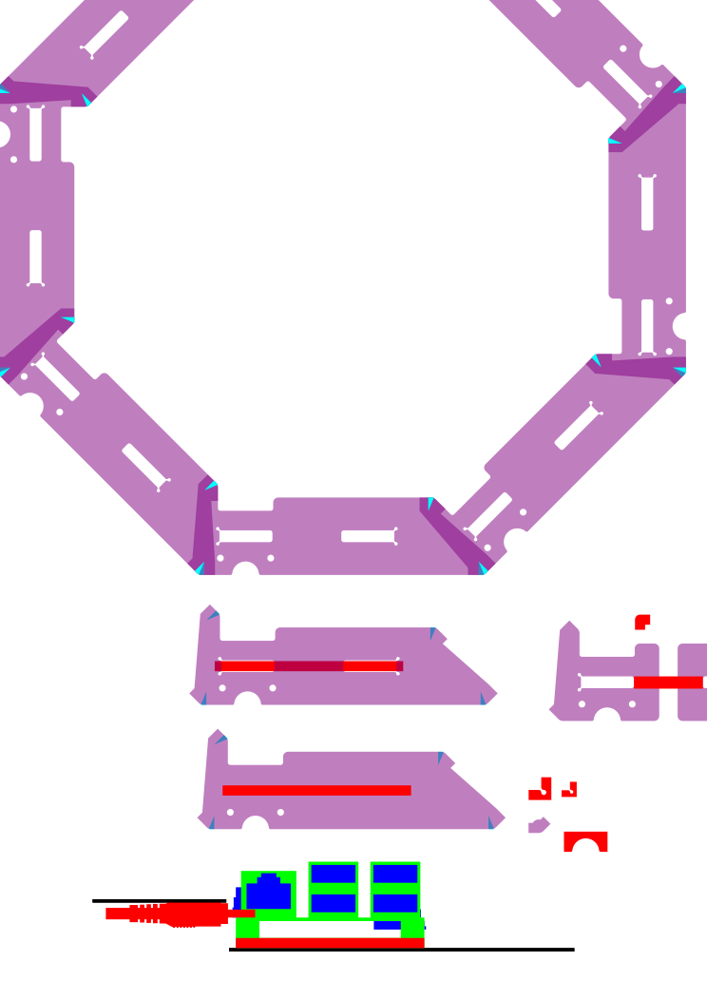
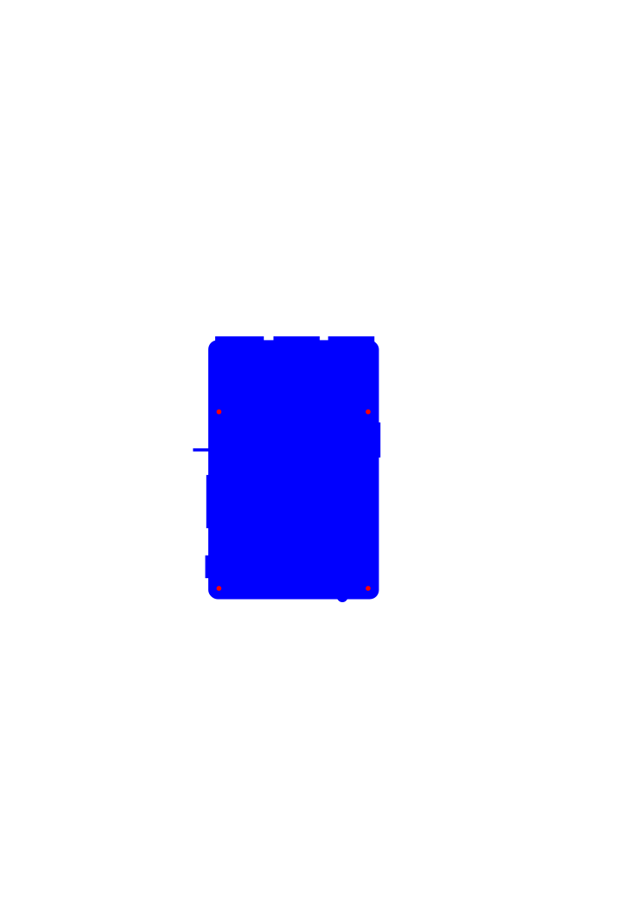

Odroid octogon case
===================

SVG images created in Inkscape by George Hawkins.

`mechanical.png` was created from <http://dn.odroid.com/S905/Schematic/C2_MAIN_REV0.2_20160226_MECH.zip> using LibreCAD and Gimp.

