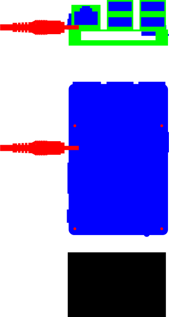
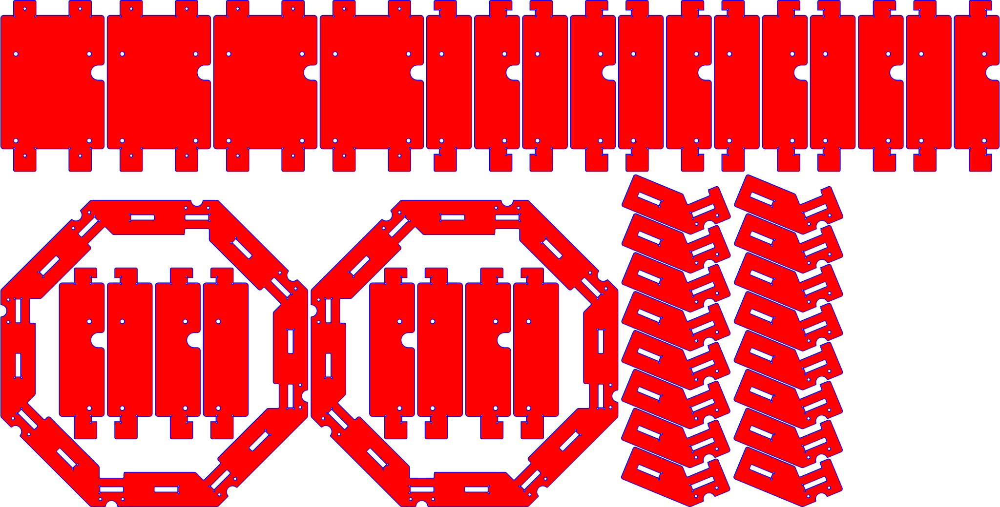
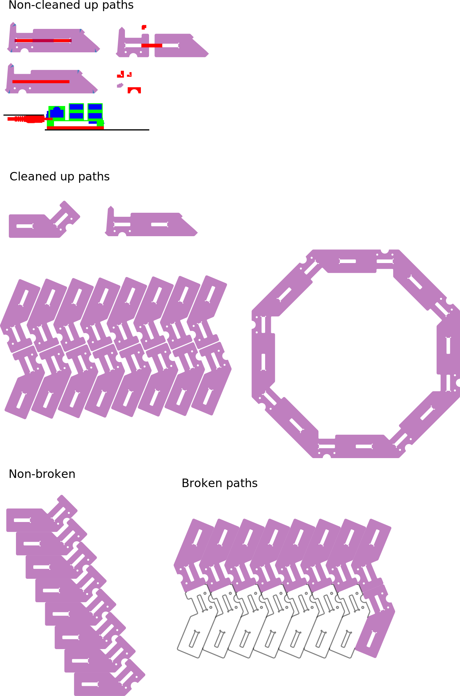
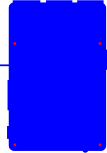
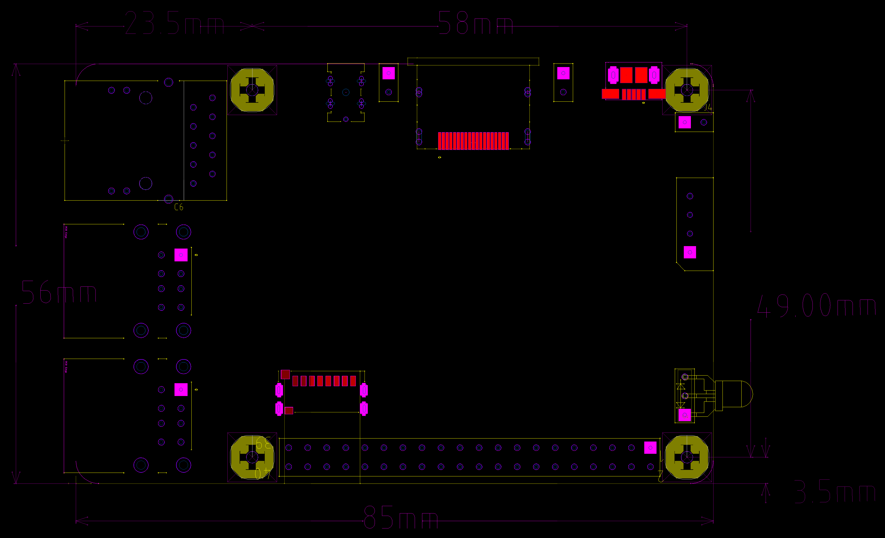

Odroid C2 octagon case
======================

Images created in Inkscape by George Hawkins. The SVG images were created using Inkscape.

`mechanical.png` was created from [C2_MAIN_REV0.2_20160226_MECH.zip](http://dn.odroid.com/S905/Schematic/C2_MAIN_REV0.2_20160226_MECH.zip) using LibreCAD and Gimp.

Two SVGs are not included inline below as they contain only 0.01mm strokes suitable for laser cutting but not visible except at extreme zoom.

They are [p2-base-eigths-outline.svg](p2-base-eigths-outline.svg) and [p2-full-octagon-outline.svg](p2-full-octagon-outline.svg).

SVGs
----

For whatever reason, some of the text, that's visible in Inkscape, doesn't show up when viewed on GitHub like this.

---

---

---

---

---

PNG
---

